# Predicting-FIFA-2022-World-Cup
# 预测2022年世界杯
```python
## This Python 3 environment comes with many helpful analytics libraries installed
# It is defined by the kaggle/python Docker image: https://github.com/kaggle/docker-python
# For example, here's several helpful packages to load

import numpy as np # linear algebra
import pandas as pd # data processing, CSV file I/O (e.g. pd.read_csv)

# Input data files are available in the read-only "../input/" directory
# For example, running this (by clicking run or pressing Shift+Enter) will list all files under the input directory

import os
for dirname, _, filenames in os.walk('/kaggle/input'):
    for filename in filenames:
        print(os.path.join(dirname, filename))

# You can write up to 20GB to the current directory (/kaggle/working/) that gets preserved as output when you create a version using "Save & Run All" 
# You can also write temporary files to /kaggle/temp/, but they won't be saved outside of the current session
```

    /kaggle/input/fifaworldranking/fifa_ranking-2022-10-06.csv
    /kaggle/input/international-football-results-from-1872-to-2017/goalscorers.csv
    /kaggle/input/international-football-results-from-1872-to-2017/shootouts.csv
    /kaggle/input/international-football-results-from-1872-to-2017/results.csv
    


```python
import pandas as pd
import re
```

# The Project

The idea here is to simulate the FIFA 2022 World Cup games with machine learning, in order to predict the competition's winner. The project uses two datasets: [International football results from 1872 to 2022](https://www.kaggle.com/datasets/martj42/international-football-results-from-1872-to-2017) and [FIFA World Ranking 1992-2022](https://www.kaggle.com/datasets/cashncarry/fifaworldranking) 

# Data Preparation

Here, I'll prepare the data to apply feature engineering methods that will create the database in order to apply Machine Learning algorithms.


```python
df =  pd.read_csv("../input/international-football-results-from-1872-to-2017/results.csv")
```


```python
df["date"] = pd.to_datetime(df["date"])
```


```python
df.isna().sum()
```


    date           0
    home_team      0
    away_team      0
    home_score    48
    away_score    48
    tournament     0
    city           0
    country        0
    neutral        0
    dtype: int64


```python
df.dropna(inplace=True)
```


```python
df.dtypes
```


    date          datetime64[ns]
    home_team             object
    away_team             object
    home_score           float64
    away_score           float64
    tournament            object
    city                  object
    country               object
    neutral                 bool
    dtype: object


The dataset used will be the FIFA Games between 2018, from after the 2018 World Cup to the last games before the 2022 World Cup. The idea is to analyze just the games played at the preparation and classification to WC.


```python
df.sort_values("date").tail()
```


<div>
<style scoped>
    .dataframe tbody tr th:only-of-type {
        vertical-align: middle;
    }

    .dataframe tbody tr th {
        vertical-align: top;
    }

    .dataframe thead th {
        text-align: right;
    }
</style>
<table border="1" class="dataframe">
  <thead>
    <tr style="text-align: right;">
      <th></th>
      <th>date</th>
      <th>home_team</th>
      <th>away_team</th>
      <th>home_score</th>
      <th>away_score</th>
      <th>tournament</th>
      <th>city</th>
      <th>country</th>
      <th>neutral</th>
    </tr>
  </thead>
  <tbody>
    <tr>
      <th>44083</th>
      <td>2022-11-16</td>
      <td>Andorra</td>
      <td>Austria</td>
      <td>0.0</td>
      <td>1.0</td>
      <td>Friendly</td>
      <td>Malaga</td>
      <td>Spain</td>
      <td>True</td>
    </tr>
    <tr>
      <th>44082</th>
      <td>2022-11-16</td>
      <td>Algeria</td>
      <td>Mali</td>
      <td>1.0</td>
      <td>1.0</td>
      <td>Friendly</td>
      <td>Oran</td>
      <td>Algeria</td>
      <td>False</td>
    </tr>
    <tr>
      <th>44081</th>
      <td>2022-11-16</td>
      <td>Albania</td>
      <td>Italy</td>
      <td>1.0</td>
      <td>3.0</td>
      <td>Friendly</td>
      <td>Tirana</td>
      <td>Albania</td>
      <td>False</td>
    </tr>
    <tr>
      <th>44091</th>
      <td>2022-11-16</td>
      <td>Mexico</td>
      <td>Sweden</td>
      <td>1.0</td>
      <td>2.0</td>
      <td>Friendly</td>
      <td>Girona</td>
      <td>Spain</td>
      <td>True</td>
    </tr>
    <tr>
      <th>44103</th>
      <td>2022-11-16</td>
      <td>Latvia</td>
      <td>Estonia</td>
      <td>1.0</td>
      <td>1.0</td>
      <td>Baltic Cup</td>
      <td>Riga</td>
      <td>Latvia</td>
      <td>False</td>
    </tr>
  </tbody>
</table>
</div>


```python
df = df[(df["date"] >= "2018-8-1")].reset_index(drop=True)
```


```python
df.sort_values("date").tail()
```


<div>
<style scoped>
    .dataframe tbody tr th:only-of-type {
        vertical-align: middle;
    }

    .dataframe tbody tr th {
        vertical-align: top;
    }

    .dataframe thead th {
        text-align: right;
    }
</style>
<table border="1" class="dataframe">
  <thead>
    <tr style="text-align: right;">
      <th></th>
      <th>date</th>
      <th>home_team</th>
      <th>away_team</th>
      <th>home_score</th>
      <th>away_score</th>
      <th>tournament</th>
      <th>city</th>
      <th>country</th>
      <th>neutral</th>
    </tr>
  </thead>
  <tbody>
    <tr>
      <th>3784</th>
      <td>2022-11-16</td>
      <td>Andorra</td>
      <td>Austria</td>
      <td>0.0</td>
      <td>1.0</td>
      <td>Friendly</td>
      <td>Malaga</td>
      <td>Spain</td>
      <td>True</td>
    </tr>
    <tr>
      <th>3783</th>
      <td>2022-11-16</td>
      <td>Algeria</td>
      <td>Mali</td>
      <td>1.0</td>
      <td>1.0</td>
      <td>Friendly</td>
      <td>Oran</td>
      <td>Algeria</td>
      <td>False</td>
    </tr>
    <tr>
      <th>3782</th>
      <td>2022-11-16</td>
      <td>Albania</td>
      <td>Italy</td>
      <td>1.0</td>
      <td>3.0</td>
      <td>Friendly</td>
      <td>Tirana</td>
      <td>Albania</td>
      <td>False</td>
    </tr>
    <tr>
      <th>3792</th>
      <td>2022-11-16</td>
      <td>Mexico</td>
      <td>Sweden</td>
      <td>1.0</td>
      <td>2.0</td>
      <td>Friendly</td>
      <td>Girona</td>
      <td>Spain</td>
      <td>True</td>
    </tr>
    <tr>
      <th>3804</th>
      <td>2022-11-16</td>
      <td>Latvia</td>
      <td>Estonia</td>
      <td>1.0</td>
      <td>1.0</td>
      <td>Baltic Cup</td>
      <td>Riga</td>
      <td>Latvia</td>
      <td>False</td>
    </tr>
  </tbody>
</table>
</div>


```python
df.home_team.value_counts()
```


    United States               45
    Mexico                      42
    Qatar                       40
    Bahrain                     38
    Japan                       37
                                ..
    Tonga                        1
    Bhutan                       1
    Alderney                     1
    Saint Helena                 1
    Northern Mariana Islands     1
    Name: home_team, Length: 247, dtype: int64


```python
rank = pd.read_csv("../input/fifaworldranking/fifa_ranking-2022-10-06.csv")
```


```python
rank["rank_date"] = pd.to_datetime(rank["rank_date"])
rank = rank[(rank["rank_date"] >= "2018-8-1")].reset_index(drop=True)

```

Some teams in the World Cup have different names in the ranking's dataset. So, it's needed to adjust. 


```python
rank["country_full"] = rank["country_full"].str.replace("IR Iran", "Iran").str.replace("Korea Republic", "South Korea").str.replace("USA", "United States")
```

The merge is made in order to get a dataset FIFA games and its rankings.


```python
rank = rank.set_index(['rank_date']).groupby(['country_full'], group_keys=False).resample('D').first().fillna(method='ffill').reset_index()
```


```python
df_wc_ranked = df.merge(rank[["country_full", "total_points", "previous_points", "rank", "rank_change", "rank_date"]], left_on=["date", "home_team"], right_on=["rank_date", "country_full"]).drop(["rank_date", "country_full"], axis=1)

df_wc_ranked = df_wc_ranked.merge(rank[["country_full", "total_points", "previous_points", "rank", "rank_change", "rank_date"]], left_on=["date", "away_team"], right_on=["rank_date", "country_full"], suffixes=("_home", "_away")).drop(["rank_date", "country_full"], axis=1)
```


```python
df_wc_ranked[(df_wc_ranked.home_team == "Brazil") | (df_wc_ranked.away_team == "Brazil")].tail(10)
```


<div>
<style scoped>
    .dataframe tbody tr th:only-of-type {
        vertical-align: middle;
    }

    .dataframe tbody tr th {
        vertical-align: top;
    }

    .dataframe thead th {
        text-align: right;
    }
</style>
<table border="1" class="dataframe">
  <thead>
    <tr style="text-align: right;">
      <th></th>
      <th>date</th>
      <th>home_team</th>
      <th>away_team</th>
      <th>home_score</th>
      <th>away_score</th>
      <th>tournament</th>
      <th>city</th>
      <th>country</th>
      <th>neutral</th>
      <th>total_points_home</th>
      <th>previous_points_home</th>
      <th>rank_home</th>
      <th>rank_change_home</th>
      <th>total_points_away</th>
      <th>previous_points_away</th>
      <th>rank_away</th>
      <th>rank_change_away</th>
    </tr>
  </thead>
  <tbody>
    <tr>
      <th>2528</th>
      <td>2021-11-11</td>
      <td>Brazil</td>
      <td>Colombia</td>
      <td>1.0</td>
      <td>0.0</td>
      <td>FIFA World Cup qualification</td>
      <td>São Paulo</td>
      <td>Brazil</td>
      <td>False</td>
      <td>1820.36</td>
      <td>1811.73</td>
      <td>2.0</td>
      <td>0.0</td>
      <td>1618.76</td>
      <td>1618.40</td>
      <td>16.0</td>
      <td>0.0</td>
    </tr>
    <tr>
      <th>2629</th>
      <td>2021-11-16</td>
      <td>Argentina</td>
      <td>Brazil</td>
      <td>0.0</td>
      <td>0.0</td>
      <td>FIFA World Cup qualification</td>
      <td>San Juan</td>
      <td>Argentina</td>
      <td>False</td>
      <td>1738.79</td>
      <td>1725.31</td>
      <td>6.0</td>
      <td>0.0</td>
      <td>1820.36</td>
      <td>1811.73</td>
      <td>2.0</td>
      <td>0.0</td>
    </tr>
    <tr>
      <th>2737</th>
      <td>2022-01-27</td>
      <td>Ecuador</td>
      <td>Brazil</td>
      <td>1.0</td>
      <td>1.0</td>
      <td>FIFA World Cup qualification</td>
      <td>Quito</td>
      <td>Ecuador</td>
      <td>False</td>
      <td>1448.27</td>
      <td>1448.74</td>
      <td>46.0</td>
      <td>0.0</td>
      <td>1826.35</td>
      <td>1826.35</td>
      <td>2.0</td>
      <td>0.0</td>
    </tr>
    <tr>
      <th>2770</th>
      <td>2022-02-01</td>
      <td>Brazil</td>
      <td>Paraguay</td>
      <td>4.0</td>
      <td>0.0</td>
      <td>FIFA World Cup qualification</td>
      <td>Belo Horizonte</td>
      <td>Brazil</td>
      <td>False</td>
      <td>1826.35</td>
      <td>1826.35</td>
      <td>2.0</td>
      <td>0.0</td>
      <td>1454.52</td>
      <td>1454.52</td>
      <td>43.0</td>
      <td>0.0</td>
    </tr>
    <tr>
      <th>2811</th>
      <td>2022-03-24</td>
      <td>Brazil</td>
      <td>Chile</td>
      <td>4.0</td>
      <td>0.0</td>
      <td>FIFA World Cup qualification</td>
      <td>Rio de Janeiro</td>
      <td>Brazil</td>
      <td>False</td>
      <td>1823.42</td>
      <td>1826.35</td>
      <td>2.0</td>
      <td>0.0</td>
      <td>1543.16</td>
      <td>1543.42</td>
      <td>26.0</td>
      <td>2.0</td>
    </tr>
    <tr>
      <th>2894</th>
      <td>2022-03-29</td>
      <td>Bolivia</td>
      <td>Brazil</td>
      <td>0.0</td>
      <td>4.0</td>
      <td>FIFA World Cup qualification</td>
      <td>La Paz</td>
      <td>Bolivia</td>
      <td>False</td>
      <td>1308.12</td>
      <td>1324.21</td>
      <td>76.0</td>
      <td>-1.0</td>
      <td>1823.42</td>
      <td>1826.35</td>
      <td>2.0</td>
      <td>0.0</td>
    </tr>
    <tr>
      <th>2986</th>
      <td>2022-06-02</td>
      <td>South Korea</td>
      <td>Brazil</td>
      <td>1.0</td>
      <td>5.0</td>
      <td>Friendly</td>
      <td>Seoul</td>
      <td>South Korea</td>
      <td>False</td>
      <td>1519.54</td>
      <td>1522.85</td>
      <td>29.0</td>
      <td>0.0</td>
      <td>1832.69</td>
      <td>1823.42</td>
      <td>1.0</td>
      <td>-1.0</td>
    </tr>
    <tr>
      <th>3054</th>
      <td>2022-06-06</td>
      <td>Japan</td>
      <td>Brazil</td>
      <td>0.0</td>
      <td>1.0</td>
      <td>Friendly</td>
      <td>Tokyo</td>
      <td>Japan</td>
      <td>False</td>
      <td>1553.44</td>
      <td>1549.82</td>
      <td>23.0</td>
      <td>0.0</td>
      <td>1832.69</td>
      <td>1823.42</td>
      <td>1.0</td>
      <td>-1.0</td>
    </tr>
    <tr>
      <th>3231</th>
      <td>2022-09-23</td>
      <td>Brazil</td>
      <td>Ghana</td>
      <td>3.0</td>
      <td>0.0</td>
      <td>Friendly</td>
      <td>Le Havre</td>
      <td>France</td>
      <td>True</td>
      <td>1837.56</td>
      <td>1837.56</td>
      <td>1.0</td>
      <td>0.0</td>
      <td>1393.47</td>
      <td>1389.68</td>
      <td>60.0</td>
      <td>0.0</td>
    </tr>
    <tr>
      <th>3300</th>
      <td>2022-09-27</td>
      <td>Brazil</td>
      <td>Tunisia</td>
      <td>5.0</td>
      <td>1.0</td>
      <td>Friendly</td>
      <td>Paris</td>
      <td>France</td>
      <td>True</td>
      <td>1837.56</td>
      <td>1837.56</td>
      <td>1.0</td>
      <td>0.0</td>
      <td>1507.86</td>
      <td>1507.86</td>
      <td>30.0</td>
      <td>0.0</td>
    </tr>
  </tbody>
</table>
</div>


Now, we have the data ready to create features based on the games' results and FIFA rankings.

# Features Engineering

The idea here is to create possible features that have impact on predicting football games. By intuition, we say that features that impact could be:

- Past game points made
- Past goals scored and suffered
- The importance of game (friendly or not)
- Rank of the teams 
- Rank increasement of the teams
- Goals made and suffered by ranking faced

So, the first thing to do is create the feature that says which team won and how much points they made at game. 


```python
df = df_wc_ranked
```


```python
def result_finder(home, away):
    if home > away:
        return pd.Series([0, 3, 0])
    if home < away:
        return pd.Series([1, 0, 3])
    else:
        return pd.Series([2, 1, 1])

results = df.apply(lambda x: result_finder(x["home_score"], x["away_score"]), axis=1)
```


```python
df[["result", "home_team_points", "away_team_points"]] = results
```

The game points are 3 for win, 1 for draw and 0 for lose and are different than the FIFA rank points that are already in the database. Also, it's supposed that FIFA Rank points and FIFA Ranking of the same team are negative correlated, and we should use only one of them to create new features. This supposition is checked below:


```python
import seaborn as sns
import matplotlib.pyplot as plt

plt.figure(figsize=(15, 10))
sns.heatmap(df[["total_points_home", "rank_home", "total_points_away", "rank_away"]].corr())
plt.show()
```


    
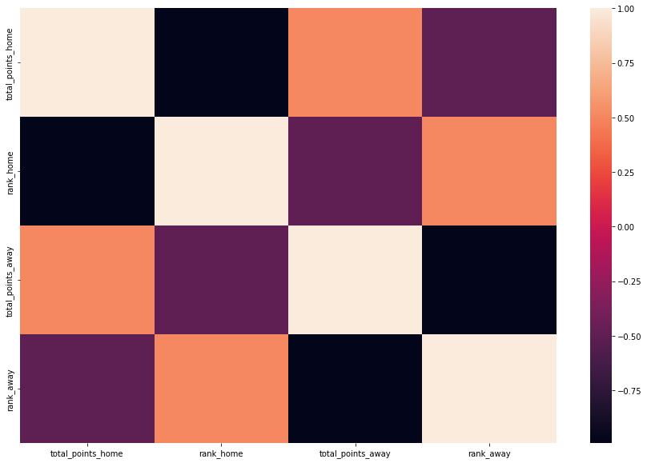
    


Now, we create columns that will help in the creation of the features: ranking difference, points won at the game vs. team faced rank, and goals difference in the game. All features that are not differences should be created for the two teams (away and home).


```python
df["rank_dif"] = df["rank_home"] - df["rank_away"]
df["sg"] = df["home_score"] - df["away_score"]
df["points_home_by_rank"] = df["home_team_points"]/df["rank_away"]
df["points_away_by_rank"] = df["away_team_points"]/df["rank_home"]
```

In order to create the features, I'll separate the dataset in home team's and away team's dataset, unify them and calculate the past game values. After that, I'll separate again and merge them, retrieving the original dataset. This proccess optimizes the creation of the features.


```python
home_team = df[["date", "home_team", "home_score", "away_score", "rank_home", "rank_away","rank_change_home", "total_points_home", "result", "rank_dif", "points_home_by_rank", "home_team_points"]]

away_team = df[["date", "away_team", "away_score", "home_score", "rank_away", "rank_home","rank_change_away", "total_points_away", "result", "rank_dif", "points_away_by_rank", "away_team_points"]]
```


```python
home_team.columns = [h.replace("home_", "").replace("_home", "").replace("away_", "suf_").replace("_away", "_suf") for h in home_team.columns]

away_team.columns = [a.replace("away_", "").replace("_away", "").replace("home_", "suf_").replace("_home", "_suf") for a in away_team.columns]
```


```python
team_stats = home_team.append(away_team)#.sort_values("date")
```


```python
#this column will be used to calculate features for simulation
team_stats_raw = team_stats.copy()
```

Now, we have a database ready to create predictive features. They will be:

- Mean goals of the team in World Cup Cycle.
- Mean goals of the team in last 5 games.
- Mean goals suffered of the team in World Cup Cycle.
- Mean goals suffered of the team in last 5 games.
- Mean FIFA Rank that team faced in World Cup Cycle.
- Mean FIFA Rank that team faced in last 5 games.
- FIFA Points won at the cycle.
- FIFA Points won in last 5 games.
- Mean game points at the Cycle.
- Mean game points at last 5 games.
- Mean game points by rank faced at the Cycle.
- Mean game points by rank faced at last 5 games.


```python
stats_val = []

for index, row in team_stats.iterrows():
    team = row["team"]
    date = row["date"]
    past_games = team_stats.loc[(team_stats["team"] == team) & (team_stats["date"] < date)].sort_values(by=['date'], ascending=False)
    last5 = past_games.head(5)
    
    goals = past_games["score"].mean()
    goals_l5 = last5["score"].mean()
    
    goals_suf = past_games["suf_score"].mean()
    goals_suf_l5 = last5["suf_score"].mean()
    
    rank = past_games["rank_suf"].mean()
    rank_l5 = last5["rank_suf"].mean()
    
    if len(last5) > 0:
        points = past_games["total_points"].values[0] - past_games["total_points"].values[-1]#qtd de pontos ganhos
        points_l5 = last5["total_points"].values[0] - last5["total_points"].values[-1] 
    else:
        points = 0
        points_l5 = 0
        
    gp = past_games["team_points"].mean()
    gp_l5 = last5["team_points"].mean()
    
    gp_rank = past_games["points_by_rank"].mean()
    gp_rank_l5 = last5["points_by_rank"].mean()
    
    stats_val.append([goals, goals_l5, goals_suf, goals_suf_l5, rank, rank_l5, points, points_l5, gp, gp_l5, gp_rank, gp_rank_l5])
```


```python
stats_cols = ["goals_mean", "goals_mean_l5", "goals_suf_mean", "goals_suf_mean_l5", "rank_mean", "rank_mean_l5", "points_mean", "points_mean_l5", "game_points_mean", "game_points_mean_l5", "game_points_rank_mean", "game_points_rank_mean_l5"]

stats_df = pd.DataFrame(stats_val, columns=stats_cols)

full_df = pd.concat([team_stats.reset_index(drop=True), stats_df], axis=1, ignore_index=False)
```


```python
home_team_stats = full_df.iloc[:int(full_df.shape[0]/2),:]
away_team_stats = full_df.iloc[int(full_df.shape[0]/2):,:]
```

The new columns:


```python
home_team_stats.columns[-12:]
```


    Index(['goals_mean', 'goals_mean_l5', 'goals_suf_mean', 'goals_suf_mean_l5',
           'rank_mean', 'rank_mean_l5', 'points_mean', 'points_mean_l5',
           'game_points_mean', 'game_points_mean_l5', 'game_points_rank_mean',
           'game_points_rank_mean_l5'],
          dtype='object')


```python
home_team_stats = home_team_stats[home_team_stats.columns[-12:]]
away_team_stats = away_team_stats[away_team_stats.columns[-12:]]
```


```python
home_team_stats.columns = ['home_'+str(col) for col in home_team_stats.columns]
away_team_stats.columns = ['away_'+str(col) for col in away_team_stats.columns]
```

In order to unify the database, is needed to add home_ and away_ suffix for each column. After that, the data is ready to be merged.


```python
match_stats = pd.concat([home_team_stats, away_team_stats.reset_index(drop=True)], axis=1, ignore_index=False)
```


```python
full_df = pd.concat([df, match_stats.reset_index(drop=True)], axis=1, ignore_index=False)
```


```python
full_df.columns
```


    Index(['date', 'home_team', 'away_team', 'home_score', 'away_score',
           'tournament', 'city', 'country', 'neutral', 'total_points_home',
           'previous_points_home', 'rank_home', 'rank_change_home',
           'total_points_away', 'previous_points_away', 'rank_away',
           'rank_change_away', 'result', 'home_team_points', 'away_team_points',
           'rank_dif', 'sg', 'points_home_by_rank', 'points_away_by_rank',
           'home_goals_mean', 'home_goals_mean_l5', 'home_goals_suf_mean',
           'home_goals_suf_mean_l5', 'home_rank_mean', 'home_rank_mean_l5',
           'home_points_mean', 'home_points_mean_l5', 'home_game_points_mean',
           'home_game_points_mean_l5', 'home_game_points_rank_mean',
           'home_game_points_rank_mean_l5', 'away_goals_mean',
           'away_goals_mean_l5', 'away_goals_suf_mean', 'away_goals_suf_mean_l5',
           'away_rank_mean', 'away_rank_mean_l5', 'away_points_mean',
           'away_points_mean_l5', 'away_game_points_mean',
           'away_game_points_mean_l5', 'away_game_points_rank_mean',
           'away_game_points_rank_mean_l5'],
          dtype='object')


Now, to quantify game importance, is created a column that finds competition of the game.


```python
def find_friendly(x):
    if x == "Friendly":
        return 1
    else: return 0

full_df["is_friendly"] = full_df["tournament"].apply(lambda x: find_friendly(x)) 
```


```python
full_df = pd.get_dummies(full_df, columns=["is_friendly"])
```


```python
full_df.columns
```


    Index(['date', 'home_team', 'away_team', 'home_score', 'away_score',
           'tournament', 'city', 'country', 'neutral', 'total_points_home',
           'previous_points_home', 'rank_home', 'rank_change_home',
           'total_points_away', 'previous_points_away', 'rank_away',
           'rank_change_away', 'result', 'home_team_points', 'away_team_points',
           'rank_dif', 'sg', 'points_home_by_rank', 'points_away_by_rank',
           'home_goals_mean', 'home_goals_mean_l5', 'home_goals_suf_mean',
           'home_goals_suf_mean_l5', 'home_rank_mean', 'home_rank_mean_l5',
           'home_points_mean', 'home_points_mean_l5', 'home_game_points_mean',
           'home_game_points_mean_l5', 'home_game_points_rank_mean',
           'home_game_points_rank_mean_l5', 'away_goals_mean',
           'away_goals_mean_l5', 'away_goals_suf_mean', 'away_goals_suf_mean_l5',
           'away_rank_mean', 'away_rank_mean_l5', 'away_points_mean',
           'away_points_mean_l5', 'away_game_points_mean',
           'away_game_points_mean_l5', 'away_game_points_rank_mean',
           'away_game_points_rank_mean_l5', 'is_friendly_0', 'is_friendly_1'],
          dtype='object')


And, after that, we select only columns that will help in Features' analysis.


```python
base_df = full_df[["date", "home_team", "away_team", "rank_home", "rank_away","home_score", "away_score","result", "rank_dif", "rank_change_home", "rank_change_away", 'home_goals_mean',
       'home_goals_mean_l5', 'home_goals_suf_mean', 'home_goals_suf_mean_l5',
       'home_rank_mean', 'home_rank_mean_l5', 'home_points_mean',
       'home_points_mean_l5', 'away_goals_mean', 'away_goals_mean_l5',
       'away_goals_suf_mean', 'away_goals_suf_mean_l5', 'away_rank_mean',
       'away_rank_mean_l5', 'away_points_mean', 'away_points_mean_l5','home_game_points_mean', 'home_game_points_mean_l5',
       'home_game_points_rank_mean', 'home_game_points_rank_mean_l5','away_game_points_mean',
       'away_game_points_mean_l5', 'away_game_points_rank_mean',
       'away_game_points_rank_mean_l5',
       'is_friendly_0', 'is_friendly_1']]

base_df.tail()
```


<div>
<style scoped>
    .dataframe tbody tr th:only-of-type {
        vertical-align: middle;
    }

    .dataframe tbody tr th {
        vertical-align: top;
    }

    .dataframe thead th {
        text-align: right;
    }
</style>
<table border="1" class="dataframe">
  <thead>
    <tr style="text-align: right;">
      <th></th>
      <th>date</th>
      <th>home_team</th>
      <th>away_team</th>
      <th>rank_home</th>
      <th>rank_away</th>
      <th>home_score</th>
      <th>away_score</th>
      <th>result</th>
      <th>rank_dif</th>
      <th>rank_change_home</th>
      <th>...</th>
      <th>home_game_points_mean</th>
      <th>home_game_points_mean_l5</th>
      <th>home_game_points_rank_mean</th>
      <th>home_game_points_rank_mean_l5</th>
      <th>away_game_points_mean</th>
      <th>away_game_points_mean_l5</th>
      <th>away_game_points_rank_mean</th>
      <th>away_game_points_rank_mean_l5</th>
      <th>is_friendly_0</th>
      <th>is_friendly_1</th>
    </tr>
  </thead>
  <tbody>
    <tr>
      <th>3331</th>
      <td>2022-09-27</td>
      <td>Norway</td>
      <td>Serbia</td>
      <td>36.0</td>
      <td>25.0</td>
      <td>0.0</td>
      <td>2.0</td>
      <td>1</td>
      <td>11.0</td>
      <td>0.0</td>
      <td>...</td>
      <td>1.833333</td>
      <td>2.0</td>
      <td>0.041984</td>
      <td>0.090235</td>
      <td>1.866667</td>
      <td>2.0</td>
      <td>0.053327</td>
      <td>0.073887</td>
      <td>1</td>
      <td>0</td>
    </tr>
    <tr>
      <th>3332</th>
      <td>2022-09-27</td>
      <td>Sweden</td>
      <td>Slovenia</td>
      <td>20.0</td>
      <td>65.0</td>
      <td>1.0</td>
      <td>1.0</td>
      <td>2</td>
      <td>-45.0</td>
      <td>0.0</td>
      <td>...</td>
      <td>1.607843</td>
      <td>0.6</td>
      <td>0.048520</td>
      <td>0.009231</td>
      <td>1.404762</td>
      <td>1.0</td>
      <td>0.026035</td>
      <td>0.029545</td>
      <td>1</td>
      <td>0</td>
    </tr>
    <tr>
      <th>3333</th>
      <td>2022-09-27</td>
      <td>Kosovo</td>
      <td>Cyprus</td>
      <td>106.0</td>
      <td>108.0</td>
      <td>5.0</td>
      <td>1.0</td>
      <td>0</td>
      <td>-2.0</td>
      <td>0.0</td>
      <td>...</td>
      <td>1.326087</td>
      <td>1.2</td>
      <td>0.018478</td>
      <td>0.016825</td>
      <td>0.767442</td>
      <td>1.0</td>
      <td>0.009687</td>
      <td>0.019652</td>
      <td>1</td>
      <td>0</td>
    </tr>
    <tr>
      <th>3334</th>
      <td>2022-09-27</td>
      <td>Greece</td>
      <td>Northern Ireland</td>
      <td>49.0</td>
      <td>58.0</td>
      <td>3.0</td>
      <td>1.0</td>
      <td>0</td>
      <td>-9.0</td>
      <td>1.0</td>
      <td>...</td>
      <td>1.590909</td>
      <td>2.4</td>
      <td>0.050090</td>
      <td>0.028040</td>
      <td>1.139535</td>
      <td>1.0</td>
      <td>0.022315</td>
      <td>0.009470</td>
      <td>1</td>
      <td>0</td>
    </tr>
    <tr>
      <th>3335</th>
      <td>2022-09-30</td>
      <td>Fiji</td>
      <td>Solomon Islands</td>
      <td>163.0</td>
      <td>137.0</td>
      <td>1.0</td>
      <td>0.0</td>
      <td>0</td>
      <td>26.0</td>
      <td>0.0</td>
      <td>...</td>
      <td>1.500000</td>
      <td>1.4</td>
      <td>0.009432</td>
      <td>0.008868</td>
      <td>1.714286</td>
      <td>2.0</td>
      <td>0.010013</td>
      <td>0.012387</td>
      <td>1</td>
      <td>0</td>
    </tr>
  </tbody>
</table>
<p>5 rows × 37 columns</p>
</div>


```python
base_df.isna().sum()
```


    date                               0
    home_team                          0
    away_team                          0
    rank_home                          0
    rank_away                          0
    home_score                         0
    away_score                         0
    result                             0
    rank_dif                           0
    rank_change_home                   0
    rank_change_away                   0
    home_goals_mean                  101
    home_goals_mean_l5               101
    home_goals_suf_mean              101
    home_goals_suf_mean_l5           101
    home_rank_mean                   101
    home_rank_mean_l5                101
    home_points_mean                   0
    home_points_mean_l5                0
    away_goals_mean                  100
    away_goals_mean_l5               100
    away_goals_suf_mean              100
    away_goals_suf_mean_l5           100
    away_rank_mean                   100
    away_rank_mean_l5                100
    away_points_mean                   0
    away_points_mean_l5                0
    home_game_points_mean            101
    home_game_points_mean_l5         101
    home_game_points_rank_mean       101
    home_game_points_rank_mean_l5    101
    away_game_points_mean            100
    away_game_points_mean_l5         100
    away_game_points_rank_mean       100
    away_game_points_rank_mean_l5    100
    is_friendly_0                      0
    is_friendly_1                      0
    dtype: int64


The games with NA are the ones who mean could not be calculated (games from the beginning of the dataset). Those will be dropped.


```python
base_df_no_fg = base_df.dropna()
```

# Data Analysis

Now, we need to analyze all features that were created and check if they have predictive power. Also, if they don't have, we need to create some that have, like differences of home and away teams. To analyze the predictive power, I'll assign draw games as a lose of the home team and will create a binary problem. 


```python
df = base_df_no_fg
```


```python
def no_draw(x):
    if x == 2:
        return 1
    else:
        return x
    
df["target"] = df["result"].apply(lambda x: no_draw(x))
```

    /opt/conda/lib/python3.7/site-packages/ipykernel_launcher.py:7: SettingWithCopyWarning: 
    A value is trying to be set on a copy of a slice from a DataFrame.
    Try using .loc[row_indexer,col_indexer] = value instead
    
    See the caveats in the documentation: https://pandas.pydata.org/pandas-docs/stable/user_guide/indexing.html#returning-a-view-versus-a-copy
      import sys
    

Analysis that will be made:

- Violin and boxplot to analyze if the features have different distributions according to the target
- Scatter plots to analyze correlations


```python
data1 = df[list(df.columns[8:20].values) + ["target"]]
data2 = df[df.columns[20:]]
```


```python
scaled = (data1[:-1] - data1[:-1].mean()) / data1[:-1].std()
scaled["target"] = data1["target"]
violin1 = pd.melt(scaled,id_vars="target", var_name="features", value_name="value")

scaled = (data2[:-1] - data2[:-1].mean()) / data2[:-1].std()
scaled["target"] = data2["target"]
violin2 = pd.melt(scaled,id_vars="target", var_name="features", value_name="value")
```


```python
plt.figure(figsize=(15,10))
sns.violinplot(x="features", y="value", hue="target", data=violin1,split=True, inner="quart")
plt.xticks(rotation=90)
plt.show()
```


    
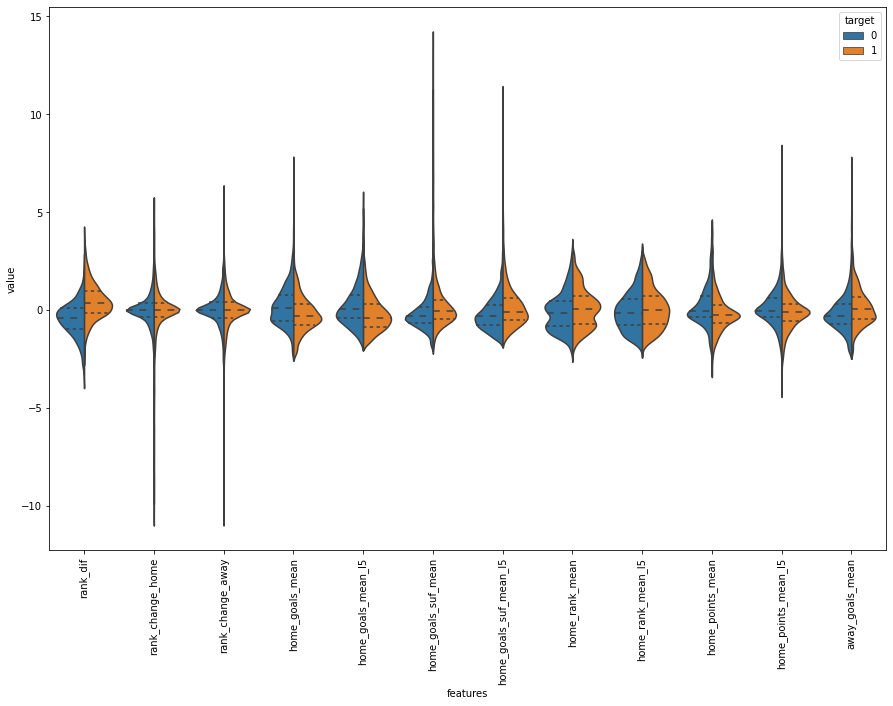
    


```python
plt.figure(figsize=(15,10))
sns.violinplot(x="features", y="value", hue="target", data=violin2,split=True, inner="quart")
plt.xticks(rotation=90)
plt.show()
```


    
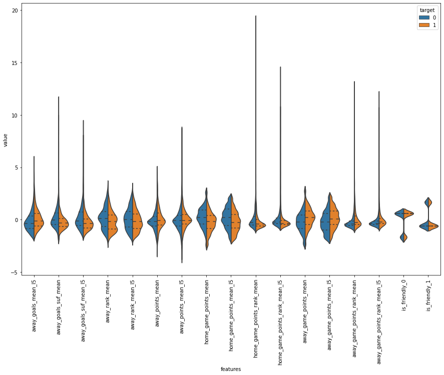
    


With the plots, we find that rank difference is the only good separator of the data. But, we can create features that get the differences between home and away team and analyze if they are good separating the data.


```python
dif = df.copy()
dif.loc[:, "goals_dif"] = dif["home_goals_mean"] - dif["away_goals_mean"]
dif.loc[:, "goals_dif_l5"] = dif["home_goals_mean_l5"] - dif["away_goals_mean_l5"]
dif.loc[:, "goals_suf_dif"] = dif["home_goals_suf_mean"] - dif["away_goals_suf_mean"]
dif.loc[:, "goals_suf_dif_l5"] = dif["home_goals_suf_mean_l5"] - dif["away_goals_suf_mean_l5"]
dif.loc[:, "goals_made_suf_dif"] = dif["home_goals_mean"] - dif["away_goals_suf_mean"]
dif.loc[:, "goals_made_suf_dif_l5"] = dif["home_goals_mean_l5"] - dif["away_goals_suf_mean_l5"]
dif.loc[:, "goals_suf_made_dif"] = dif["home_goals_suf_mean"] - dif["away_goals_mean"]
dif.loc[:, "goals_suf_made_dif_l5"] = dif["home_goals_suf_mean_l5"] - dif["away_goals_mean_l5"]
```


```python
data_difs = dif.iloc[:, -8:]
scaled = (data_difs - data_difs.mean()) / data_difs.std()
scaled["target"] = data2["target"]
violin = pd.melt(scaled,id_vars="target", var_name="features", value_name="value")

plt.figure(figsize=(10,10))
sns.violinplot(x="features", y="value", hue="target", data=violin,split=True, inner="quart")
plt.xticks(rotation=90)
plt.show()
```


    
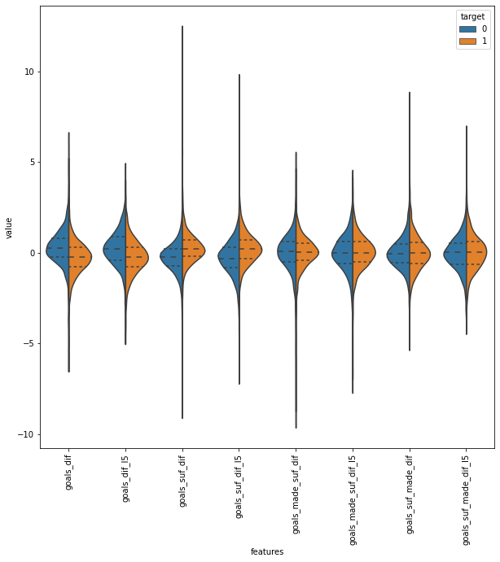
    


With that plot, we see that goal differences are good separator, and goals suffered difference too. Differences between goals made and goals suffered of the teams are not very good separators.

Now, we have 5 features:

- rank_dif
- goals_dif
- goals_dif_l5
- goals_suf_dif
- goals_suf_dif_l5

We can create other features, like differences of points made, differences of points made by rank faced and differences of rank faced.


```python
dif.loc[:, "dif_points"] = dif["home_game_points_mean"] - dif["away_game_points_mean"]
dif.loc[:, "dif_points_l5"] = dif["home_game_points_mean_l5"] - dif["away_game_points_mean_l5"]
dif.loc[:, "dif_points_rank"] = dif["home_game_points_rank_mean"] - dif["away_game_points_rank_mean"]
dif.loc[:, "dif_points_rank_l5"] = dif["home_game_points_rank_mean_l5"] - dif["away_game_points_rank_mean_l5"]
```


```python
dif.loc[:, "dif_rank_agst"] = dif["home_rank_mean"] - dif["away_rank_mean"]
dif.loc[:, "dif_rank_agst_l5"] = dif["home_rank_mean_l5"] - dif["away_rank_mean_l5"]
```

Also, we can calculate goals made and suffered by rank, and check this difference.


```python
dif.loc[:, "goals_per_ranking_dif"] = (dif["home_goals_mean"] / dif["home_rank_mean"]) - (dif["away_goals_mean"] / dif["away_rank_mean"])
dif.loc[:, "goals_per_ranking_suf_dif"] = (dif["home_goals_suf_mean"] / dif["home_rank_mean"]) - (dif["away_goals_suf_mean"] / dif["away_rank_mean"])
dif.loc[:, "goals_per_ranking_dif_l5"] = (dif["home_goals_mean_l5"] / dif["home_rank_mean"]) - (dif["away_goals_mean_l5"] / dif["away_rank_mean"])
dif.loc[:, "goals_per_ranking_suf_dif_l5"] = (dif["home_goals_suf_mean_l5"] / dif["home_rank_mean"]) - (dif["away_goals_suf_mean_l5"] / dif["away_rank_mean"])
```


```python
data_difs = dif.iloc[:, -10:]
scaled = (data_difs - data_difs.mean()) / data_difs.std()
scaled["target"] = data2["target"]
violin = pd.melt(scaled,id_vars="target", var_name="features", value_name="value")

plt.figure(figsize=(15,10))
sns.violinplot(x="features", y="value", hue="target", data=violin,split=True, inner="quart")
plt.xticks(rotation=90)
plt.show()
```


    
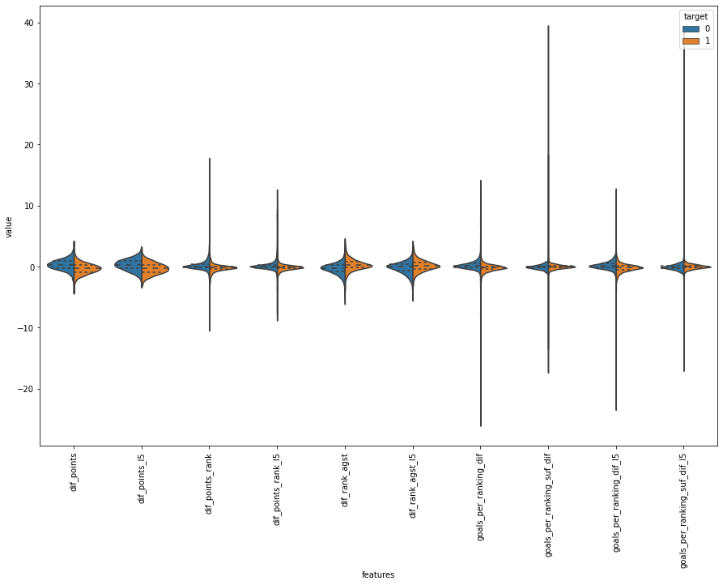
    


Due to the low values, the violin plot was not a good choice to analyze if features are really separating the data in this case. We will see then the boxplot:


```python
plt.figure(figsize=(15,10))
sns.boxplot(x="features", y="value", hue="target", data=violin)
plt.xticks(rotation=90)
plt.show()
```


    
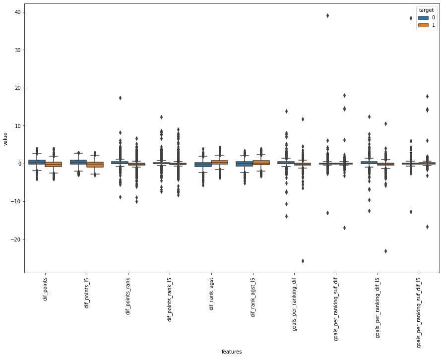
    


Difference of points (full and last 5 games), difference of points by ranking faced (full and last 5 games) and difference of rank faced (full and last 5 games) are good features. Also, some of the generated features have very similar distributions which will be analyzed using scatterplots.


```python
sns.jointplot(data = data_difs, x = 'goals_per_ranking_dif', y = 'goals_per_ranking_dif_l5', kind="reg")
plt.show()
```


    
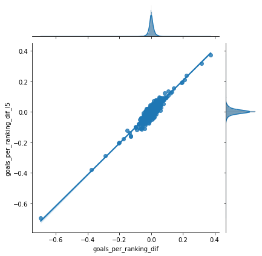
    


Goals difference by ranking faced and its last 5 games version has very similar distributions. So, we will use only the full version (goals_per_ranking_dif).


```python
sns.jointplot(data = data_difs, x = 'dif_rank_agst', y = 'dif_rank_agst_l5', kind="reg")
plt.show()
```


    
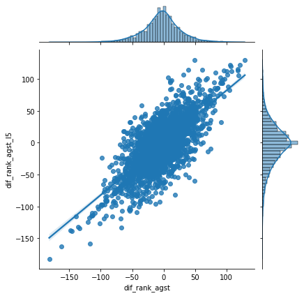
    


```python
sns.jointplot(data = data_difs, x = 'dif_points', y = 'dif_points_l5', kind="reg")
plt.show()
```


    
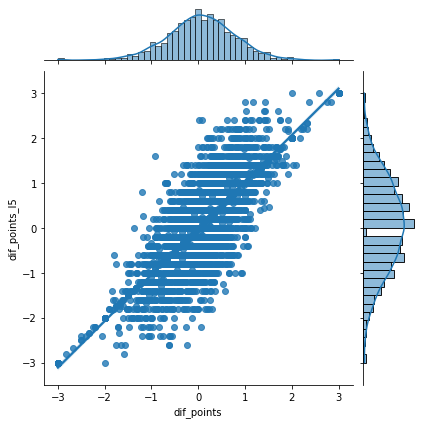
    


```python
sns.jointplot(data = data_difs, x = 'dif_points_rank', y = 'dif_points_rank_l5', kind="reg")
plt.show()
```


    
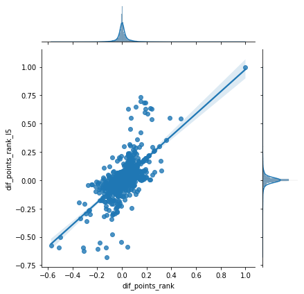
    


For the differences of rank faced, game points by rank faced and mean game points by rank faced, the two versions (full and 5 games) are not so similar. So, we will use both.

Based on that, final features are:


- rank_dif
- goals_dif
- goals_dif_l5
- goals_suf_dif
- goals_suf_dif_l5
- dif_rank_agst
- dif_rank_agst_l5
- goals_per_ranking_dif
- dif_points_rank
- dif_points_rank_l5
- is_friendly


```python
def create_db(df):
    columns = ["home_team", "away_team", "target", "rank_dif", "home_goals_mean", "home_rank_mean", "away_goals_mean", "away_rank_mean", "home_rank_mean_l5", "away_rank_mean_l5", "home_goals_suf_mean", "away_goals_suf_mean", "home_goals_mean_l5", "away_goals_mean_l5", "home_goals_suf_mean_l5", "away_goals_suf_mean_l5", "home_game_points_rank_mean", "home_game_points_rank_mean_l5", "away_game_points_rank_mean", "away_game_points_rank_mean_l5","is_friendly_0", "is_friendly_1"]
    
    base = df.loc[:, columns]
    base.loc[:, "goals_dif"] = base["home_goals_mean"] - base["away_goals_mean"]
    base.loc[:, "goals_dif_l5"] = base["home_goals_mean_l5"] - base["away_goals_mean_l5"]
    base.loc[:, "goals_suf_dif"] = base["home_goals_suf_mean"] - base["away_goals_suf_mean"]
    base.loc[:, "goals_suf_dif_l5"] = base["home_goals_suf_mean_l5"] - base["away_goals_suf_mean_l5"]
    base.loc[:, "goals_per_ranking_dif"] = (base["home_goals_mean"] / base["home_rank_mean"]) - (base["away_goals_mean"] / base["away_rank_mean"])
    base.loc[:, "dif_rank_agst"] = base["home_rank_mean"] - base["away_rank_mean"]
    base.loc[:, "dif_rank_agst_l5"] = base["home_rank_mean_l5"] - base["away_rank_mean_l5"]
    base.loc[:, "dif_points_rank"] = base["home_game_points_rank_mean"] - base["away_game_points_rank_mean"]
    base.loc[:, "dif_points_rank_l5"] = base["home_game_points_rank_mean_l5"] - base["away_game_points_rank_mean_l5"]
    
    model_df = base[["home_team", "away_team", "target", "rank_dif", "goals_dif", "goals_dif_l5", "goals_suf_dif", "goals_suf_dif_l5", "goals_per_ranking_dif", "dif_rank_agst", "dif_rank_agst_l5", "dif_points_rank", "dif_points_rank_l5", "is_friendly_0", "is_friendly_1"]]
    return model_df
```


```python
model_db = create_db(df)
```


```python
model_db
```


<div>
<style scoped>
    .dataframe tbody tr th:only-of-type {
        vertical-align: middle;
    }

    .dataframe tbody tr th {
        vertical-align: top;
    }

    .dataframe thead th {
        text-align: right;
    }
</style>
<table border="1" class="dataframe">
  <thead>
    <tr style="text-align: right;">
      <th></th>
      <th>home_team</th>
      <th>away_team</th>
      <th>target</th>
      <th>rank_dif</th>
      <th>goals_dif</th>
      <th>goals_dif_l5</th>
      <th>goals_suf_dif</th>
      <th>goals_suf_dif_l5</th>
      <th>goals_per_ranking_dif</th>
      <th>dif_rank_agst</th>
      <th>dif_rank_agst_l5</th>
      <th>dif_points_rank</th>
      <th>dif_points_rank_l5</th>
      <th>is_friendly_0</th>
      <th>is_friendly_1</th>
    </tr>
  </thead>
  <tbody>
    <tr>
      <th>4</th>
      <td>Barbados</td>
      <td>Cuba</td>
      <td>1</td>
      <td>-21.0</td>
      <td>2.000000</td>
      <td>2.0</td>
      <td>1.000000</td>
      <td>1.0</td>
      <td>0.037037</td>
      <td>-92.000000</td>
      <td>-92.0</td>
      <td>0.018519</td>
      <td>0.018519</td>
      <td>0</td>
      <td>1</td>
    </tr>
    <tr>
      <th>6</th>
      <td>Barbados</td>
      <td>Cuba</td>
      <td>1</td>
      <td>-21.0</td>
      <td>1.000000</td>
      <td>1.0</td>
      <td>0.500000</td>
      <td>0.5</td>
      <td>0.008511</td>
      <td>-35.500000</td>
      <td>-35.5</td>
      <td>0.008897</td>
      <td>0.008897</td>
      <td>0</td>
      <td>1</td>
    </tr>
    <tr>
      <th>31</th>
      <td>Mongolia</td>
      <td>Guam</td>
      <td>1</td>
      <td>-4.0</td>
      <td>4.000000</td>
      <td>4.0</td>
      <td>-1.000000</td>
      <td>-1.0</td>
      <td>0.021622</td>
      <td>0.000000</td>
      <td>0.0</td>
      <td>0.016216</td>
      <td>0.016216</td>
      <td>1</td>
      <td>0</td>
    </tr>
    <tr>
      <th>32</th>
      <td>Nepal</td>
      <td>Bhutan</td>
      <td>0</td>
      <td>-22.0</td>
      <td>1.000000</td>
      <td>1.0</td>
      <td>0.000000</td>
      <td>0.0</td>
      <td>0.004975</td>
      <td>7.000000</td>
      <td>7.0</td>
      <td>0.000000</td>
      <td>0.000000</td>
      <td>1</td>
      <td>0</td>
    </tr>
    <tr>
      <th>33</th>
      <td>Bangladesh</td>
      <td>Pakistan</td>
      <td>0</td>
      <td>-7.0</td>
      <td>-1.000000</td>
      <td>-1.0</td>
      <td>-0.500000</td>
      <td>-0.5</td>
      <td>-0.007200</td>
      <td>30.500000</td>
      <td>30.5</td>
      <td>-0.010437</td>
      <td>-0.010437</td>
      <td>1</td>
      <td>0</td>
    </tr>
    <tr>
      <th>...</th>
      <td>...</td>
      <td>...</td>
      <td>...</td>
      <td>...</td>
      <td>...</td>
      <td>...</td>
      <td>...</td>
      <td>...</td>
      <td>...</td>
      <td>...</td>
      <td>...</td>
      <td>...</td>
      <td>...</td>
      <td>...</td>
      <td>...</td>
    </tr>
    <tr>
      <th>3331</th>
      <td>Norway</td>
      <td>Serbia</td>
      <td>1</td>
      <td>11.0</td>
      <td>-0.038095</td>
      <td>-0.8</td>
      <td>-0.230159</td>
      <td>0.0</td>
      <td>-0.005282</td>
      <td>9.014286</td>
      <td>-3.4</td>
      <td>-0.011343</td>
      <td>0.016348</td>
      <td>1</td>
      <td>0</td>
    </tr>
    <tr>
      <th>3332</th>
      <td>Sweden</td>
      <td>Slovenia</td>
      <td>1</td>
      <td>-45.0</td>
      <td>0.030812</td>
      <td>0.2</td>
      <td>0.137255</td>
      <td>0.2</td>
      <td>0.009459</td>
      <td>-25.102241</td>
      <td>10.2</td>
      <td>0.022485</td>
      <td>-0.020314</td>
      <td>1</td>
      <td>0</td>
    </tr>
    <tr>
      <th>3333</th>
      <td>Kosovo</td>
      <td>Cyprus</td>
      <td>0</td>
      <td>-2.0</td>
      <td>0.667341</td>
      <td>0.6</td>
      <td>-0.463094</td>
      <td>0.0</td>
      <td>0.007625</td>
      <td>7.037917</td>
      <td>1.6</td>
      <td>0.008791</td>
      <td>-0.002827</td>
      <td>1</td>
      <td>0</td>
    </tr>
    <tr>
      <th>3334</th>
      <td>Greece</td>
      <td>Northern Ireland</td>
      <td>0</td>
      <td>-9.0</td>
      <td>0.067653</td>
      <td>0.2</td>
      <td>-0.369979</td>
      <td>-1.2</td>
      <td>-0.002915</td>
      <td>16.024841</td>
      <td>0.6</td>
      <td>0.027775</td>
      <td>0.018570</td>
      <td>1</td>
      <td>0</td>
    </tr>
    <tr>
      <th>3335</th>
      <td>Fiji</td>
      <td>Solomon Islands</td>
      <td>0</td>
      <td>26.0</td>
      <td>-1.119048</td>
      <td>-0.6</td>
      <td>-0.634921</td>
      <td>-0.8</td>
      <td>-0.006351</td>
      <td>-7.476190</td>
      <td>5.8</td>
      <td>-0.000581</td>
      <td>-0.003519</td>
      <td>1</td>
      <td>0</td>
    </tr>
  </tbody>
</table>
<p>3201 rows × 15 columns</p>
</div>


# The model

Now that we have a database ready and with columns with predictive power, we can start our modelling. 

Two models will be tested: Random Forest and Gradient Boosting. The selected will be the one with best recall.


```python
X = model_db.iloc[:, 3:]
y = model_db[["target"]]
```


```python
from sklearn.ensemble import RandomForestClassifier, GradientBoostingClassifier
from sklearn.model_selection import train_test_split, GridSearchCV
```


```python
X_train, X_test, y_train, y_test = train_test_split(X, y, test_size= 0.2, random_state=1)
```


```python
gb = GradientBoostingClassifier(random_state=5)

params = {"learning_rate": [0.01, 0.1, 0.5],
            "min_samples_split": [5, 10],
            "min_samples_leaf": [3, 5],
            "max_depth":[3,5,10],
            "max_features":["sqrt"],
            "n_estimators":[100, 200]
         } 

gb_cv = GridSearchCV(gb, params, cv = 3, n_jobs = -1, verbose = False)

gb_cv.fit(X_train.values, np.ravel(y_train))
```


    GridSearchCV(cv=3, estimator=GradientBoostingClassifier(random_state=5),
                 n_jobs=-1,
                 param_grid={'learning_rate': [0.01, 0.1, 0.5],
                             'max_depth': [3, 5, 10], 'max_features': ['sqrt'],
                             'min_samples_leaf': [3, 5],
                             'min_samples_split': [5, 10],
                             'n_estimators': [100, 200]},
                 verbose=False)


```python
gb = gb_cv.best_estimator_
```


```python
gb
```


    GradientBoostingClassifier(learning_rate=0.01, max_features='sqrt',
                               min_samples_leaf=3, min_samples_split=5,
                               random_state=5)


```python
params_rf = {"max_depth": [20],
                "min_samples_split": [10],
                "max_leaf_nodes": [175],
                "min_samples_leaf": [5],
                "n_estimators": [250],
                 "max_features": ["sqrt"],
                }

rf = RandomForestClassifier(random_state=1)

rf_cv = GridSearchCV(rf, params_rf, cv = 3, n_jobs = -1, verbose = False)

rf_cv.fit(X_train.values, np.ravel(y_train))
```


    GridSearchCV(cv=3, estimator=RandomForestClassifier(random_state=1), n_jobs=-1,
                 param_grid={'max_depth': [20], 'max_features': ['sqrt'],
                             'max_leaf_nodes': [175], 'min_samples_leaf': [5],
                             'min_samples_split': [10], 'n_estimators': [250]},
                 verbose=False)


```python
rf = rf_cv.best_estimator_
```


```python
from sklearn.metrics import confusion_matrix, roc_curve, roc_auc_score
```


```python
def analyze(model):
    fpr, tpr, _ = roc_curve(y_test, model.predict_proba(X_test.values)[:,1]) #test AUC
    plt.figure(figsize=(15,10))
    plt.plot([0, 1], [0, 1], 'k--')
    plt.plot(fpr, tpr, label="test")

    fpr_train, tpr_train, _ = roc_curve(y_train, model.predict_proba(X_train.values)[:,1]) #train AUC
    plt.plot(fpr_train, tpr_train, label="train")
    auc_test = roc_auc_score(y_test, model.predict_proba(X_test.values)[:,1])
    auc_train = roc_auc_score(y_train, model.predict_proba(X_train.values)[:,1])
    plt.legend()
    plt.title('AUC score is %.2f on test and %.2f on training'%(auc_test, auc_train))
    plt.show()
    
    plt.figure(figsize=(15, 10))
    cm = confusion_matrix(y_test, model.predict(X_test.values))
    sns.heatmap(cm, annot=True, fmt="d")
```


```python
analyze(gb)
```


    
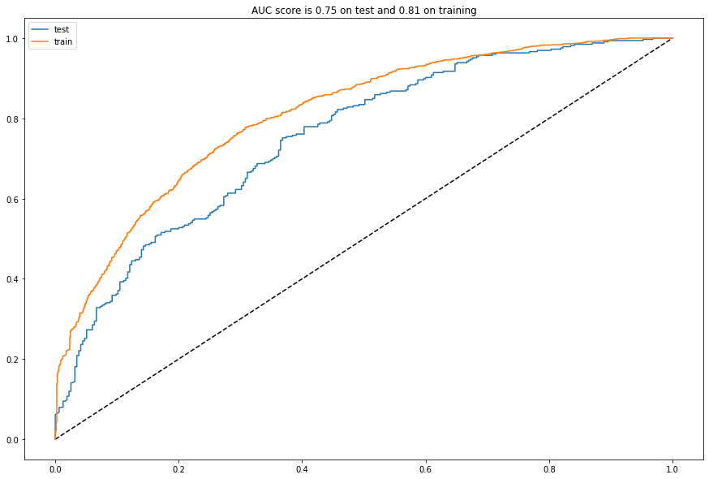
    


    
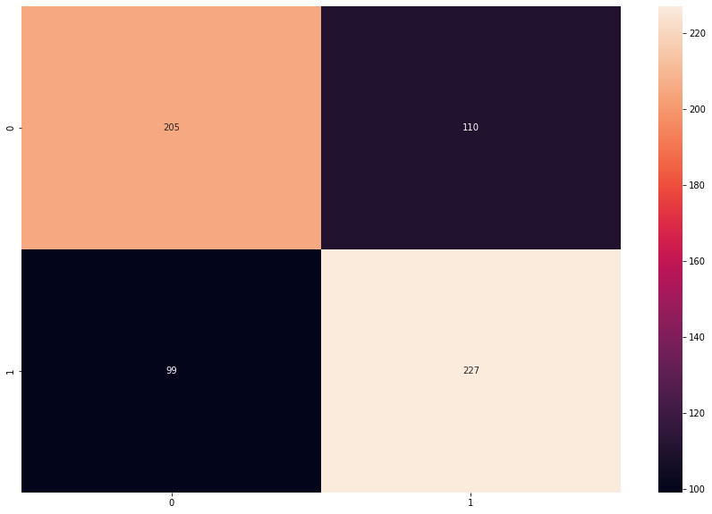
    


```python
analyze(rf)
```


    
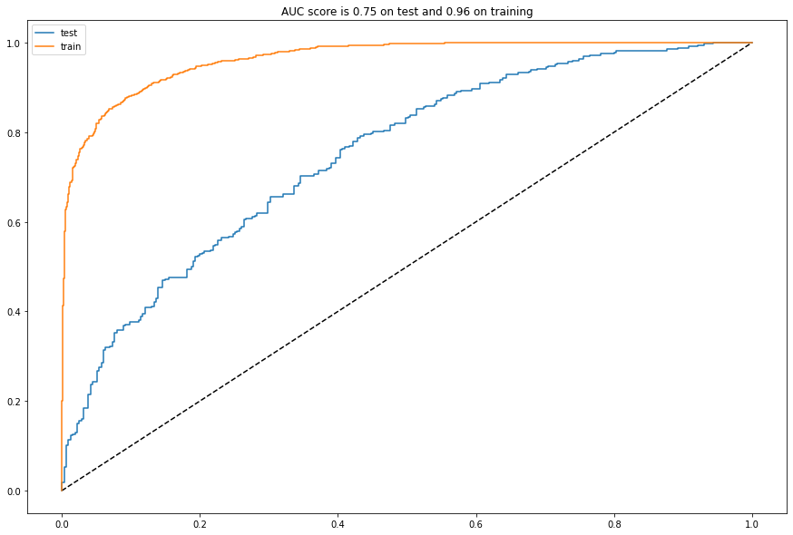
    


    

    


The Random Forest model is a little bit better but seems to underfit. So, we will use the Gradient Boosting Model.


```python
from operator import itemgetter
```

# WC Simulation

The first thing is to create FIFA World Cup games. To do this, I'll get in the wikipedia the teams and group phase matches.


```python
dfs = pd.read_html(r"https://en.wikipedia.org/wiki/2022_FIFA_World_Cup#Teams")
```


```python
from collections.abc import Iterable

for i in range(len(dfs)):
    df = dfs[i]
    cols = list(df.columns.values)
    
    if isinstance(cols[0], Iterable):
        if any("Tie-breaking criteria" in c for c in cols):
            start_pos = i+1

        if any("Match 46" in c for c in cols):
            end_pos = i+1
```


```python
matches = []
groups = ["A", "B", "C", "D", "E", "F", "G", "H"]
group_count = 0 

table = {}
#TABLE -> TEAM, POINTS, WIN PROBS (CRITERIO DE DESEMPATE)
table[groups[group_count]] = [[a.split(" ")[0], 0, []] for a in list(dfs[start_pos].iloc[:, 1].values)]

for i in range(start_pos+1, end_pos, 1):
    if len(dfs[i].columns) == 3:
        team_1 = dfs[i].columns.values[0]
        team_2 = dfs[i].columns.values[-1]
        
        matches.append((groups[group_count], team_1, team_2))
    else:
        group_count+=1
        table[groups[group_count]] = [[a, 0, []] for a in list(dfs[i].iloc[:, 1].values)]
```


```python
table
```


    {'A': [['Qatar', 0, []],
      ['Ecuador', 0, []],
      ['Senegal', 0, []],
      ['Netherlands', 0, []]],
     'B': [['England', 0, []],
      ['Iran', 0, []],
      ['United States', 0, []],
      ['Wales', 0, []]],
     'C': [['Argentina', 0, []],
      ['Saudi Arabia', 0, []],
      ['Mexico', 0, []],
      ['Poland', 0, []]],
     'D': [['France', 0, []],
      ['Australia', 0, []],
      ['Denmark', 0, []],
      ['Tunisia', 0, []]],
     'E': [['Spain', 0, []],
      ['Costa Rica', 0, []],
      ['Germany', 0, []],
      ['Japan', 0, []]],
     'F': [['Belgium', 0, []],
      ['Canada', 0, []],
      ['Morocco', 0, []],
      ['Croatia', 0, []]],
     'G': [['Brazil', 0, []],
      ['Serbia', 0, []],
      ['Switzerland', 0, []],
      ['Cameroon', 0, []]],
     'H': [['Portugal', 0, []],
      ['Ghana', 0, []],
      ['Uruguay', 0, []],
      ['South Korea', 0, []]]}


Above, we also store the team's points at the group and its probabilities of win in each game. The mean of team's wins probabilities will be used as tiebreaker when two teams have the same number of points.


```python
matches[:10]
```


    [('A', 'Qatar', 'Ecuador'),
     ('A', 'Senegal', 'Netherlands'),
     ('A', 'Qatar', 'Senegal'),
     ('A', 'Netherlands', 'Ecuador'),
     ('A', 'Ecuador', 'Senegal'),
     ('A', 'Netherlands', 'Qatar'),
     ('B', 'England', 'Iran'),
     ('B', 'United States', 'Wales'),
     ('B', 'Wales', 'Iran'),
     ('B', 'England', 'United States')]


I will use last game stats as the stats for each team involved in the game. Like, for Brazil vs Serbia, the stats of Brazil is the ones they had in the last game and for Serbia too.


```python
def find_stats(team_1):
#team_1 = "Qatar"
    past_games = team_stats_raw[(team_stats_raw["team"] == team_1)].sort_values("date")
    last5 = team_stats_raw[(team_stats_raw["team"] == team_1)].sort_values("date").tail(5)

    team_1_rank = past_games["rank"].values[-1]
    team_1_goals = past_games.score.mean()
    team_1_goals_l5 = last5.score.mean()
    team_1_goals_suf = past_games.suf_score.mean()
    team_1_goals_suf_l5 = last5.suf_score.mean()
    team_1_rank_suf = past_games.rank_suf.mean()
    team_1_rank_suf_l5 = last5.rank_suf.mean()
    team_1_gp_rank = past_games.points_by_rank.mean()
    team_1_gp_rank_l5 = last5.points_by_rank.mean()

    return [team_1_rank, team_1_goals, team_1_goals_l5, team_1_goals_suf, team_1_goals_suf_l5, team_1_rank_suf, team_1_rank_suf_l5, team_1_gp_rank, team_1_gp_rank_l5]
```


```python
def find_features(team_1, team_2):
    rank_dif = team_1[0] - team_2[0]
    goals_dif = team_1[1] - team_2[1]
    goals_dif_l5 = team_1[2] - team_2[2]
    goals_suf_dif = team_1[3] - team_2[3]
    goals_suf_dif_l5 = team_1[4] - team_2[4]
    goals_per_ranking_dif = (team_1[1]/team_1[5]) - (team_2[1]/team_2[5])
    dif_rank_agst = team_1[5] - team_2[5]
    dif_rank_agst_l5 = team_1[6] - team_2[6]
    dif_gp_rank = team_1[7] - team_2[7]
    dif_gp_rank_l5 = team_1[8] - team_2[8]
    
    return [rank_dif, goals_dif, goals_dif_l5, goals_suf_dif, goals_suf_dif_l5, goals_per_ranking_dif, dif_rank_agst, dif_rank_agst_l5, dif_gp_rank, dif_gp_rank_l5, 1, 0]
```

Now, we are able to simulate.

Since the model simulates if team 1 will win or not win, it's needed to create some criteria to define a draw. Also, since we have not home advantage at World Cup, the idea is to predict game two times, changing team 1 and team 2. The team with the highest mean of probabilities will be assigned as winner. At the group phase, if "home team" win as team 1 and loses as team 2, or if "home team" win as team 2 and loses at team 1, there will be assigned a draw in that match.


```python
advanced_group = []
last_group = ""

for k in table.keys():
    for t in table[k]:
        t[1] = 0
        t[2] = []
        
for teams in matches:
    draw = False
    team_1 = find_stats(teams[1])
    team_2 = find_stats(teams[2])

    

    features_g1 = find_features(team_1, team_2)
    features_g2 = find_features(team_2, team_1)

    probs_g1 = gb.predict_proba([features_g1])
    probs_g2 = gb.predict_proba([features_g2])
    
    team_1_prob_g1 = probs_g1[0][0]
    team_1_prob_g2 = probs_g2[0][1]
    team_2_prob_g1 = probs_g1[0][1]
    team_2_prob_g2 = probs_g2[0][0]

    team_1_prob = (probs_g1[0][0] + probs_g2[0][1])/2
    team_2_prob = (probs_g2[0][0] + probs_g1[0][1])/2
    
    if ((team_1_prob_g1 > team_2_prob_g1) & (team_2_prob_g2 > team_1_prob_g2)) | ((team_1_prob_g1 < team_2_prob_g1) & (team_2_prob_g2 < team_1_prob_g2)):
        draw=True
        for i in table[teams[0]]:
            if i[0] == teams[1] or i[0] == teams[2]:
                i[1] += 1
                
    elif team_1_prob > team_2_prob:
        winner = teams[1]
        winner_proba = team_1_prob
        for i in table[teams[0]]:
            if i[0] == teams[1]:
                i[1] += 3
                
    elif team_2_prob > team_1_prob:  
        winner = teams[2]
        winner_proba = team_2_prob
        for i in table[teams[0]]:
            if i[0] == teams[2]:
                i[1] += 3
    
    for i in table[teams[0]]: #adding criterio de desempate (probs por jogo)
            if i[0] == teams[1]:
                i[2].append(team_1_prob)
            if i[0] == teams[2]:
                i[2].append(team_2_prob)

    if last_group != teams[0]:
        if last_group != "":
            print("\n")
            print("Group %s advanced: "%(last_group))
            
            for i in table[last_group]: #adding crieterio de desempate
                i[2] = np.mean(i[2])
            
            final_points = table[last_group]
            final_table = sorted(final_points, key=itemgetter(1, 2), reverse = True)
            advanced_group.append([final_table[0][0], final_table[1][0]])
            for i in final_table:
                print("%s -------- %d"%(i[0], i[1]))
        print("\n")
        print("-"*10+" Starting Analysis for Group %s "%(teams[0])+"-"*10)
        
        
    if draw == False:
        print("Group %s - %s vs. %s: Winner %s with %.2f probability"%(teams[0], teams[1], teams[2], winner, winner_proba))
    else:
        print("Group %s - %s vs. %s: Draw"%(teams[0], teams[1], teams[2]))
    last_group =  teams[0]

print("\n")
print("Group %s advanced: "%(last_group))

for i in table[last_group]: #adding crieterio de desempate
    i[2] = np.mean(i[2])
            
final_points = table[last_group]
final_table = sorted(final_points, key=itemgetter(1, 2), reverse = True)
advanced_group.append([final_table[0][0], final_table[1][0]])
for i in final_table:
    print("%s -------- %d"%(i[0], i[1]))
```

    
    
    ---------- Starting Analysis for Group A ----------
    Group A - Qatar vs. Ecuador: Winner Ecuador with 0.60 probability
    Group A - Senegal vs. Netherlands: Winner Netherlands with 0.59 probability
    Group A - Qatar vs. Senegal: Winner Senegal with 0.58 probability
    Group A - Netherlands vs. Ecuador: Winner Netherlands with 0.66 probability
    Group A - Ecuador vs. Senegal: Winner Ecuador with 0.53 probability
    Group A - Netherlands vs. Qatar: Winner Netherlands with 0.69 probability
    
    
    Group A advanced: 
    Netherlands -------- 9
    Ecuador -------- 6
    Senegal -------- 3
    Qatar -------- 0
    
    
    ---------- Starting Analysis for Group B ----------
    Group B - England vs. Iran: Winner England with 0.60 probability
    Group B - United States vs. Wales: Draw
    Group B - Wales vs. Iran: Winner Wales with 0.54 probability
    Group B - England vs. United States: Winner England with 0.58 probability
    Group B - Wales vs. England: Winner England with 0.60 probability
    Group B - Iran vs. United States: Winner United States with 0.57 probability
    
    
    Group B advanced: 
    England -------- 9
    United States -------- 4
    Wales -------- 4
    Iran -------- 0
    
    
    ---------- Starting Analysis for Group C ----------
    Group C - Argentina vs. Saudi Arabia: Winner Argentina with 0.70 probability
    Group C - Mexico vs. Poland: Draw
    Group C - Poland vs. Saudi Arabia: Winner Poland with 0.64 probability
    Group C - Argentina vs. Mexico: Winner Argentina with 0.62 probability
    Group C - Poland vs. Argentina: Winner Argentina with 0.64 probability
    Group C - Saudi Arabia vs. Mexico: Winner Mexico with 0.64 probability
    
    
    Group C advanced: 
    Argentina -------- 9
    Poland -------- 4
    Mexico -------- 4
    Saudi Arabia -------- 0
    
    
    ---------- Starting Analysis for Group D ----------
    Group D - Denmark vs. Tunisia: Winner Denmark with 0.63 probability
    Group D - France vs. Australia: Winner France with 0.65 probability
    Group D - Tunisia vs. Australia: Draw
    Group D - France vs. Denmark: Draw
    Group D - Australia vs. Denmark: Winner Denmark with 0.65 probability
    Group D - Tunisia vs. France: Winner France with 0.63 probability
    
    
    Group D advanced: 
    France -------- 7
    Denmark -------- 7
    Tunisia -------- 1
    Australia -------- 1
    
    
    ---------- Starting Analysis for Group E ----------
    Group E - Germany vs. Japan: Winner Germany with 0.59 probability
    Group E - Spain vs. Costa Rica: Winner Spain with 0.68 probability
    Group E - Japan vs. Costa Rica: Draw
    Group E - Spain vs. Germany: Draw
    Group E - Japan vs. Spain: Winner Spain with 0.62 probability
    Group E - Costa Rica vs. Germany: Winner Germany with 0.60 probability
    
    
    Group E advanced: 
    Spain -------- 7
    Germany -------- 7
    Japan -------- 1
    Costa Rica -------- 1
    
    
    ---------- Starting Analysis for Group F ----------
    Group F - Morocco vs. Croatia: Winner Croatia with 0.58 probability
    Group F - Belgium vs. Canada: Winner Belgium with 0.67 probability
    Group F - Belgium vs. Morocco: Winner Belgium with 0.63 probability
    Group F - Croatia vs. Canada: Winner Croatia with 0.62 probability
    Group F - Croatia vs. Belgium: Winner Belgium with 0.60 probability
    Group F - Canada vs. Morocco: Draw
    
    
    Group F advanced: 
    Belgium -------- 9
    Croatia -------- 6
    Morocco -------- 1
    Canada -------- 1
    
    
    ---------- Starting Analysis for Group G ----------
    Group G - Switzerland vs. Cameroon: Winner Switzerland with 0.62 probability
    Group G - Brazil vs. Serbia: Winner Brazil with 0.63 probability
    Group G - Cameroon vs. Serbia: Winner Serbia with 0.61 probability
    Group G - Brazil vs. Switzerland: Draw
    Group G - Serbia vs. Switzerland: Winner Switzerland with 0.56 probability
    Group G - Cameroon vs. Brazil: Winner Brazil with 0.71 probability
    
    
    Group G advanced: 
    Brazil -------- 7
    Switzerland -------- 7
    Serbia -------- 3
    Cameroon -------- 0
    
    
    ---------- Starting Analysis for Group H ----------
    Group H - Uruguay vs. South Korea: Winner Uruguay with 0.60 probability
    Group H - Portugal vs. Ghana: Winner Portugal with 0.71 probability
    Group H - South Korea vs. Ghana: Winner South Korea with 0.69 probability
    Group H - Portugal vs. Uruguay: Draw
    Group H - Ghana vs. Uruguay: Winner Uruguay with 0.69 probability
    Group H - South Korea vs. Portugal: Winner Portugal with 0.63 probability
    
    
    Group H advanced: 
    Portugal -------- 7
    Uruguay -------- 7
    South Korea -------- 3
    Ghana -------- 0
    

The group phase predicted no surprises, or maybe the draw between Brazil and Switzerland or France and Denmark. For the playoffs phase, I'll predict and show it graphically as made [here](https://www.kaggle.com/code/agostontorok/soccer-world-cup-2018-winner). 


```python
advanced = advanced_group
```


```python
playoffs = {"Round of 16": [], "Quarter-Final": [], "Semi-Final": [], "Final": []}
```


```python
for p in playoffs.keys():
    playoffs[p] = []

actual_round = ""
next_rounds = []

for p in playoffs.keys():
    if p == "Round of 16":
        control = []
        for a in range(0, len(advanced*2), 1):
            if a < len(advanced):
                if a % 2 == 0:
                    control.append((advanced*2)[a][0])
                else:
                    control.append((advanced*2)[a][1])
            else:
                if a % 2 == 0:
                    control.append((advanced*2)[a][1])
                else:
                    control.append((advanced*2)[a][0])

        playoffs[p] = [[control[c], control[c+1]] for c in range(0, len(control)-1, 1) if c%2 == 0]
        
        for i in range(0, len(playoffs[p]), 1):
            game = playoffs[p][i]
            
            home = game[0]
            away = game[1]
            team_1 = find_stats(home)
            team_2 = find_stats(away)

            features_g1 = find_features(team_1, team_2)
            features_g2 = find_features(team_2, team_1)
            
            probs_g1 = gb.predict_proba([features_g1])
            probs_g2 = gb.predict_proba([features_g2])
            
            team_1_prob = (probs_g1[0][0] + probs_g2[0][1])/2
            team_2_prob = (probs_g2[0][0] + probs_g1[0][1])/2
            
            if actual_round != p:
                print("-"*10)
                print("Starting simulation of %s"%(p))
                print("-"*10)
                print("\n")
            
            if team_1_prob < team_2_prob:
                print("%s vs. %s: %s advances with prob %.2f"%(home, away, away, team_2_prob))
                next_rounds.append(away)
            else:
                print("%s vs. %s: %s advances with prob %.2f"%(home, away, home, team_1_prob))
                next_rounds.append(home)
            
            game.append([team_1_prob, team_2_prob])
            playoffs[p][i] = game
            actual_round = p
        
    else:
        playoffs[p] = [[next_rounds[c], next_rounds[c+1]] for c in range(0, len(next_rounds)-1, 1) if c%2 == 0]
        next_rounds = []
        for i in range(0, len(playoffs[p])):
            game = playoffs[p][i]
            home = game[0]
            away = game[1]
            team_1 = find_stats(home)
            team_2 = find_stats(away)
            
            features_g1 = find_features(team_1, team_2)
            features_g2 = find_features(team_2, team_1)
            
            probs_g1 = gb.predict_proba([features_g1])
            probs_g2 = gb.predict_proba([features_g2])
            
            team_1_prob = (probs_g1[0][0] + probs_g2[0][1])/2
            team_2_prob = (probs_g2[0][0] + probs_g1[0][1])/2
            
            if actual_round != p:
                print("-"*10)
                print("Starting simulation of %s"%(p))
                print("-"*10)
                print("\n")
            
            if team_1_prob < team_2_prob:
                print("%s vs. %s: %s advances with prob %.2f"%(home, away, away, team_2_prob))
                next_rounds.append(away)
            else:
                print("%s vs. %s: %s advances with prob %.2f"%(home, away, home, team_1_prob))
                next_rounds.append(home)
            game.append([team_1_prob, team_2_prob])
            playoffs[p][i] = game
            actual_round = p
            
```

    ----------
    Starting simulation of Round of 16
    ----------
    
    
    Netherlands vs. United States: Netherlands advances with prob 0.55
    Argentina vs. Denmark: Argentina advances with prob 0.59
    Spain vs. Croatia: Spain advances with prob 0.57
    Brazil vs. Uruguay: Brazil advances with prob 0.60
    Ecuador vs. England: England advances with prob 0.65
    Poland vs. France: France advances with prob 0.60
    Germany vs. Belgium: Belgium advances with prob 0.50
    Switzerland vs. Portugal: Portugal advances with prob 0.52
    ----------
    Starting simulation of Quarter-Final
    ----------
    
    
    Netherlands vs. Argentina: Netherlands advances with prob 0.52
    Spain vs. Brazil: Brazil advances with prob 0.51
    England vs. France: France advances with prob 0.51
    Belgium vs. Portugal: Portugal advances with prob 0.52
    ----------
    Starting simulation of Semi-Final
    ----------
    
    
    Netherlands vs. Brazil: Brazil advances with prob 0.52
    France vs. Portugal: Portugal advances with prob 0.52
    ----------
    Starting simulation of Final
    ----------
    
    
    Brazil vs. Portugal: Brazil advances with prob 0.52
    


```python
import networkx as nx
from networkx.drawing.nx_pydot import graphviz_layout
```


```python
plt.figure(figsize=(15, 10))
G = nx.balanced_tree(2, 3)


labels = []


for p in playoffs.keys():
    for game in playoffs[p]:
        label = f"{game[0]}({round(game[2][0], 2)}) \n {game[1]}({round(game[2][1], 2)})"
        labels.append(label)
    
labels_dict = {}
labels_rev = list(reversed(labels))

for l in range(len(list(G.nodes))):
    labels_dict[l] = labels_rev[l]

pos = graphviz_layout(G, prog='twopi')
labels_pos = {n: (k[0], k[1]-0.08*k[1]) for n,k in pos.items()}
center  = pd.DataFrame(pos).mean(axis=1).mean()
    

nx.draw(G, pos = pos, with_labels=False, node_color=range(15), edge_color="#bbf5bb", width=10, font_weight='bold',cmap=plt.cm.Greens, node_size=5000)
nx.draw_networkx_labels(G, pos = labels_pos, bbox=dict(boxstyle="round,pad=0.3", fc="white", ec="black", lw=.5, alpha=1),
                        labels=labels_dict)
texts = ["Round \nof 16", "Quarter \n Final", "Semi \n Final", "Final\n"]
pos_y = pos[0][1] + 55
for text in reversed(texts):
    pos_x = center
    pos_y -= 75 
    plt.text(pos_y, pos_x, text, fontsize = 18)

plt.axis('equal')
plt.show()
```


    
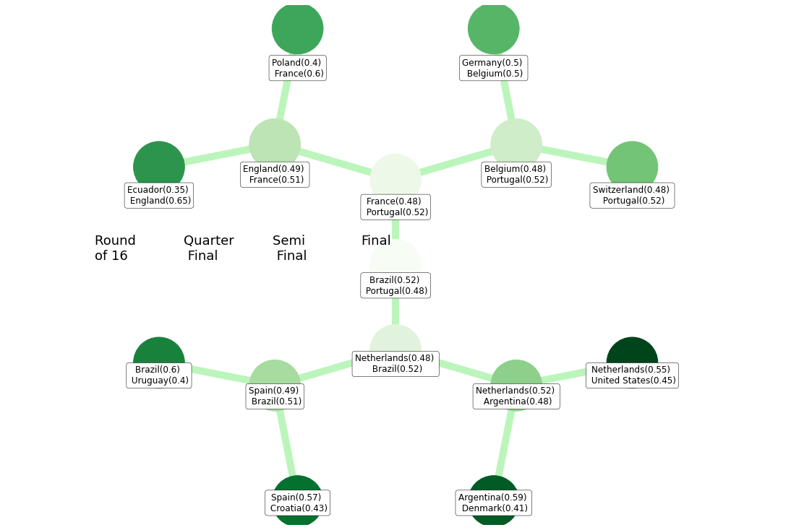
    


And that's the final simulation! Brazil has won the 6th title! Hoping that my predictions are correct now. 

It's nice to analyze too the possible upsets. Belgium passed against Germany, and were defeated by Portugal. Argentina - Netherlands game is very tight, with Netherlands passing by nearly 1%. The same happens between France and England, with England passing. I think England as finalist was the biggest upset of the simulation.

Update: the databases were updated with the last friendlies that national teams played before the World Cup, and, with that, some simulations changed. France now beats England at quarter-final, and they are defeated by Portugal in the semis! Portugal at the finals is a huge surprise! 

# Conclusion

The goal of this was to improve my knowledge with Machine Learning simulating something that I love (Football World Cup). I think that's amazing to create models that we can see the result in real life, and that's what is going to happen!

In general, I think that the model predicted like the common sense of people who watch football. There are not huge surprises in the simulation. It's also nice to see games with teams that are more unkown in group phase, like Iran vs. Wales or Senegal vs. Ecuador. I think that in games like that, the model is a good guidance to betting, since the knowledge of most people second tier national teams is not great.


```python

```
